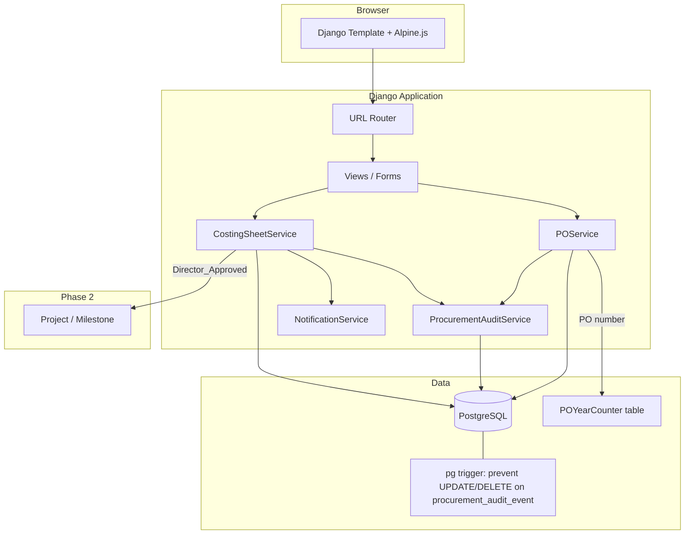
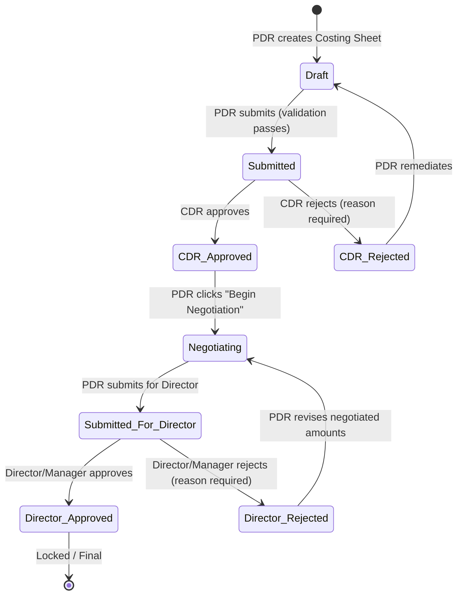

# Design Document: Procurement and Costing Sheet

## Overview

The Procurement and Costing Sheet feature is Phase 3 of the ATA Workflow Manager. It introduces a formal procurement workflow that sits between an approved Project (Phase 2) and the delivery of training services. A PDR creates a Costing Sheet for an active Project, collects up to three provider quotes per line item, and routes the sheet through a mandatory two-stage approval chain: CDR (technical/scope validation) then Director/Manager (financial authority). After full approval the PDR negotiates final pricing, generates a Purchase Order, and tracks supplier ETAs against Milestone target dates.

### Key Design Goals

- Strict two-stage approval state machine with no threshold bypass — every Costing Sheet must pass both CDR and Director stages
- Immutable negotiation history — original CDR-approved amounts are snapshotted and never overwritten; negotiated amounts are stored separately and shown side-by-side at Director review
- Race-condition-safe PO number generation using `SELECT FOR UPDATE` on a per-year counter row
- Milestone linkage — on Director approval the system writes `costing_sheet_line_item_id`, `original_cost_amount`, and `original_currency` back to the linked Phase 2 Milestone records
- Same immutable audit trail pattern as Phase 1 and Phase 2, enforced by a PostgreSQL trigger
- Role separation enforced at the service layer: CDR approver cannot be the submitting PDR; Director approver cannot be the CDR approver on the same sheet

---

## Architecture



Business logic lives entirely in the service layer. Views are thin — they validate forms, call services, and render responses. The `NotificationService` from Phase 1 is extended with new in-app notification methods; failures are caught and logged without rolling back the triggering transition.

---

## Approval State Machine



### Transition Table

| From | To | Actor | Guard |
|---|---|---|---|
| Draft | Submitted | PDR (owner) | ≥1 line item; all line items have selected provider |
| Submitted | CDR_Approved | CDR | User has CDR role; user ≠ submitting PDR |
| Submitted | CDR_Rejected | CDR | Same + rejection reason non-empty |
| CDR_Rejected | Draft | PDR (owner) | Remediate action |
| CDR_Approved | Negotiating | PDR (owner) | Begin Negotiation action |
| Negotiating | Submitted_For_Director | PDR (owner) | No additional guard |
| Submitted_For_Director | Director_Approved | Director_Manager | User has Director or Manager role; user ≠ CDR approver on this sheet; if any line item has `negotiated_amount > original_approved_amount`, a justification reason is required |
| Submitted_For_Director | Director_Rejected | Director_Manager | Same role/conflict guard + rejection reason non-empty |
| Director_Rejected | Negotiating | PDR (owner) | PDR retains negotiated amounts and may revise before resubmitting to Director |
| Director_Approved | * | Any | Blocked — terminal/locked state |

Invalid transitions raise `CostingSheetTransitionError`. The service layer enforces all guards before writing any state change.

---

## Components and Interfaces

### URL Patterns

```python
# procurement/urls.py
urlpatterns = [
    # Costing Sheets
    path("",                                            views.cs_list,              name="cs_list"),
    path("create/<int:project_pk>/",                    views.cs_create,            name="cs_create"),
    path("<int:pk>/",                                   views.cs_detail,            name="cs_detail"),
    path("<int:pk>/submit/",                            views.cs_submit,            name="cs_submit"),
    path("<int:pk>/cdr-approve/",                       views.cs_cdr_approve,       name="cs_cdr_approve"),
    path("<int:pk>/cdr-reject/",                        views.cs_cdr_reject,        name="cs_cdr_reject"),
    path("<int:pk>/begin-negotiation/",                 views.cs_begin_negotiation, name="cs_begin_negotiation"),
    path("<int:pk>/revise-quote/",                      views.cs_revise_quote,      name="cs_revise_quote"),
    path("<int:pk>/submit-for-director/",               views.cs_submit_for_director, name="cs_submit_for_director"),
    path("<int:pk>/director-approve/",                  views.cs_director_approve,  name="cs_director_approve"),
    path("<int:pk>/director-reject/",                   views.cs_director_reject,   name="cs_director_reject"),
    path("<int:pk>/remediate/",                         views.cs_remediate,         name="cs_remediate"),
    # Line Items
    path("<int:pk>/line-items/add/",                    views.li_add,               name="li_add"),
    path("<int:pk>/line-items/<int:li_pk>/edit/",       views.li_edit,              name="li_edit"),
    path("<int:pk>/line-items/<int:li_pk>/delete/",     views.li_delete,            name="li_delete"),
    # Purchase Orders
    path("<int:pk>/po/generate/",                       views.po_generate,          name="po_generate"),
    path("po/<int:po_pk>/",                             views.po_detail,            name="po_detail"),
    path("po/<int:po_pk>/issue/",                       views.po_issue,             name="po_issue"),
    path("po/<int:po_pk>/fulfill/",                     views.po_fulfill,           name="po_fulfill"),
    path("po/<int:po_pk>/cancel/",                      views.po_cancel,            name="po_cancel"),
    path("po/<int:po_pk>/line-items/<int:li_pk>/eta/",  views.po_li_eta,            name="po_li_eta"),
    path("po/<int:po_pk>/line-items/<int:li_pk>/delivery/", views.po_li_delivery,   name="po_li_delivery"),
]
```

### Views

| View | Method | Auth Guard | Description |
|---|---|---|---|
| `cs_list` | GET | Login required | All sheets; filtered by role |
| `cs_create` | GET/POST | PDR | Create sheet for active project |
| `cs_detail` | GET | Login required | Sheet + line items + audit trail |
| `cs_submit` | POST | PDR (owner) | Draft → Submitted |
| `cs_cdr_approve` | POST | CDR | Submitted → CDR_Approved |
| `cs_cdr_reject` | POST | CDR | Submitted → CDR_Rejected |
| `cs_begin_negotiation` | POST | PDR (owner) | CDR_Approved → Negotiating |
| `cs_revise_quote` | POST | PDR (owner) | Update line item quote during Negotiating |
| `cs_submit_for_director` | POST | PDR (owner) | Negotiating → Submitted_For_Director |
| `cs_director_approve` | POST | Director_Manager | Submitted_For_Director → Director_Approved |
| `cs_director_reject` | POST | Director_Manager | Submitted_For_Director → Director_Rejected |
| `cs_remediate` | GET/POST | PDR (owner) | CDR_Rejected → Draft; Director_Rejected → Negotiating |
| `li_add` | GET/POST | PDR | Add line item to Draft sheet |
| `li_edit` | GET/POST | PDR | Edit line item on Draft sheet |
| `li_delete` | POST | PDR | Delete line item from Draft sheet |
| `po_generate` | POST | PDR | Generate PO from Director_Approved sheet |
| `po_detail` | GET | Login required | PO + line items + audit trail |
| `po_issue` | POST | PDR | Draft → Issued |
| `po_fulfill` | POST | PDR | Issued → Fulfilled (blocked if notify_client_required) |
| `po_cancel` | POST | PDR | Draft/Issued → Cancelled |
| `po_li_eta` | POST | PDR | Record or update supplier ETA |
| `po_li_delivery` | POST | PDR | Record actual delivery date |

### CostingSheetService

```python
class CostingSheetService:
    @staticmethod
    def create(project: Project, pdr: User) -> CostingSheet:
        """Creates sheet in Draft. Raises if project not Active or sheet already exists."""

    @staticmethod
    def submit(sheet: CostingSheet, pdr: User) -> CostingSheet:
        """Draft → Submitted. Validates ≥1 line item, all have selected_provider."""

    @staticmethod
    def cdr_approve(sheet: CostingSheet, cdr: User) -> CostingSheet:
        """Submitted → CDR_Approved. Snapshots original_approved_amount on all line items."""

    @staticmethod
    def cdr_reject(sheet: CostingSheet, cdr: User, reason: str) -> CostingSheet:
        """Submitted → CDR_Rejected."""

    @staticmethod
    def begin_negotiation(sheet: CostingSheet, pdr: User) -> CostingSheet:
        """CDR_Approved → Negotiating."""

    @staticmethod
    def revise_quote(sheet: CostingSheet, line_item: CostingSheetLineItem,
                     pdr: User, amount: Decimal, currency: str) -> CostingSheetLineItem:
        """Updates negotiated_amount/currency on a line item during Negotiating phase."""

    @staticmethod
    def submit_for_director(sheet: CostingSheet, pdr: User) -> CostingSheet:
        """Negotiating → Submitted_For_Director."""

    @staticmethod
    def director_approve(sheet: CostingSheet, director: User, justification: str = "") -> CostingSheet:
        """Submitted_For_Director → Director_Approved.
        Requires justification if any line item has negotiated_amount > original_approved_amount.
        Triggers Milestone linkage."""

    @staticmethod
    def director_reject(sheet: CostingSheet, director: User, reason: str) -> CostingSheet:
        """Submitted_For_Director → Director_Rejected."""

    @staticmethod
    def remediate_after_director(sheet: CostingSheet, pdr: User) -> CostingSheet:
        """Director_Rejected → Negotiating. PDR retains negotiated amounts."""

    @staticmethod
    def _link_milestones(sheet: CostingSheet) -> None:
        """Called by director_approve. Updates Milestone fields. Logs unmatched items."""
```

### POService

```python
class POService:
    @staticmethod
    def generate(costing_sheet: CostingSheet, pdr: User) -> PurchaseOrder:
        """Creates PO in Draft. Generates PO number. Creates POLineItems from CS line items."""

    @staticmethod
    def mark_issued(po: PurchaseOrder, pdr: User) -> PurchaseOrder:
        """Draft → Issued."""

    @staticmethod
    def mark_fulfilled(po: PurchaseOrder, pdr: User) -> PurchaseOrder:
        """Issued → Fulfilled. Raises if notify_client_required is True on any line item."""

    @staticmethod
    def cancel(po: PurchaseOrder, pdr: User, reason: str) -> PurchaseOrder:
        """Draft/Issued → Cancelled."""

    @staticmethod
    def record_eta(po_line_item: POLineItem, pdr: User, eta_date: date) -> POLineItem:
        """Sets supplier_eta. Sets notify_client_required if delta > 7 days from previous ETA."""

    @staticmethod
    def update_eta(po_line_item: POLineItem, pdr: User, eta_date: date) -> POLineItem:
        """Updates supplier_eta. Same notify_client_required logic as record_eta."""

    @staticmethod
    def record_actual_delivery(po_line_item: POLineItem, pdr: User,
                                delivery_date: date) -> POLineItem:
        """Sets actual_delivery_date."""

    @staticmethod
    def _generate_po_number(year: int) -> str:
        """SELECT FOR UPDATE on POYearCounter. Returns PO-{YYYY}-{NNNN}."""
```

### ProcurementAuditService

```python
class ProcurementAuditService:
    @staticmethod
    def record(sheet: CostingSheet, actor: User,
               action: str, detail: dict = None) -> ProcurementAuditEvent:
        """INSERT only — never UPDATE or DELETE."""
```

### Permission Helpers

```python
PROCUREMENT_ROLES = {"PDR", "CDR", "Director_Manager", "PC"}

def is_pdr(user: User) -> bool: ...
def is_cdr(user: User) -> bool: ...
def is_director_manager(user: User) -> bool: ...
def is_pc(user: User) -> bool: ...
def require_pdr(view_func): ...          # 403 if not PDR
def require_cdr(view_func): ...          # 403 if not CDR
def require_director_manager(view_func): ...  # 403 if not Director_Manager
```

Role is read from `UserProfile.role` (CharField, established in Phase 1/2).

---

## Data Models

### CostingSheet

```python
class CostingSheet(models.Model):
    class Status(models.TextChoices):
        DRAFT                  = "Draft"
        SUBMITTED              = "Submitted"
        CDR_APPROVED           = "CDR_Approved"
        CDR_REJECTED           = "CDR_Rejected"
        NEGOTIATING            = "Negotiating"
        SUBMITTED_FOR_DIRECTOR = "Submitted_For_Director"
        DIRECTOR_APPROVED      = "Director_Approved"
        DIRECTOR_REJECTED      = "Director_Rejected"

    project    = models.OneToOneField(
        "projects.Project", on_delete=models.PROTECT, related_name="costing_sheet"
    )
    status     = models.CharField(
        max_length=30, choices=Status.choices, default=Status.DRAFT
    )
    pdr        = models.ForeignKey(
        User, on_delete=models.PROTECT, related_name="costing_sheets_as_pdr"
    )
    cdr        = models.ForeignKey(
        User, on_delete=models.PROTECT, related_name="costing_sheets_as_cdr",
        null=True, blank=True
    )
    director   = models.ForeignKey(
        User, on_delete=models.PROTECT, related_name="costing_sheets_as_director",
        null=True, blank=True
    )
    created_at = models.DateTimeField(auto_now_add=True)
    updated_at = models.DateTimeField(auto_now=True)

    class Meta:
        ordering = ["-created_at"]
```

The `OneToOneField` on `project` enforces the "one Costing Sheet per Project" constraint at the database level.

### CostingSheetLineItem

```python
class CostingSheetLineItem(models.Model):
    class ProviderChoice(models.IntegerChoices):
        PROVIDER_1 = 1
        PROVIDER_2 = 2
        PROVIDER_3 = 3

    costing_sheet     = models.ForeignKey(
        CostingSheet, on_delete=models.CASCADE, related_name="line_items"
    )
    line_item_id      = models.UUIDField(default=uuid.uuid4, editable=False, unique=True)
    description       = models.CharField(max_length=500)
    unit              = models.CharField(max_length=100, blank=True)
    quantity          = models.PositiveIntegerField()

    # Provider 1
    provider_1_name     = models.CharField(max_length=255, blank=True)
    provider_1_amount   = models.DecimalField(max_digits=14, decimal_places=2, null=True, blank=True)
    provider_1_currency = models.CharField(max_length=3, blank=True)

    # Provider 2
    provider_2_name     = models.CharField(max_length=255, blank=True)
    provider_2_amount   = models.DecimalField(max_digits=14, decimal_places=2, null=True, blank=True)
    provider_2_currency = models.CharField(max_length=3, blank=True)

    # Provider 3
    provider_3_name     = models.CharField(max_length=255, blank=True)
    provider_3_amount   = models.DecimalField(max_digits=14, decimal_places=2, null=True, blank=True)
    provider_3_currency = models.CharField(max_length=3, blank=True)

    selected_provider   = models.IntegerField(
        choices=ProviderChoice.choices, null=True, blank=True
    )

    # Snapshotted at CDR_Approved — read-only after that point
    original_approved_amount   = models.DecimalField(
        max_digits=14, decimal_places=2, null=True, blank=True
    )
    original_approved_currency = models.CharField(max_length=3, blank=True)

    # Set during Negotiating phase
    negotiated_amount   = models.DecimalField(
        max_digits=14, decimal_places=2, null=True, blank=True
    )
    negotiated_currency = models.CharField(max_length=3, blank=True)

    saved_by   = models.ForeignKey(
        User, on_delete=models.PROTECT, related_name="saved_line_items"
    )
    saved_at   = models.DateTimeField(auto_now=True)

    class Meta:
        ordering = ["saved_at"]
```

`line_item_id` (UUID) is assigned at creation and never changes. It is the stable identifier used to match line items to Phase 2 Milestones (via `Milestone.costing_sheet_line_item_id`).

**Selected quote helper:**

```python
@property
def selected_amount(self) -> Decimal | None:
    """Returns the negotiated amount if set, else the original approved amount,
    else the raw selected provider amount."""
    if self.negotiated_amount is not None:
        return self.negotiated_amount
    if self.original_approved_amount is not None:
        return self.original_approved_amount
    return getattr(self, f"provider_{self.selected_provider}_amount", None)

@property
def selected_currency(self) -> str:
    if self.negotiated_currency:
        return self.negotiated_currency
    if self.original_approved_currency:
        return self.original_approved_currency
    return getattr(self, f"provider_{self.selected_provider}_currency", "")
```

### POYearCounter

```python
class POYearCounter(models.Model):
    year    = models.IntegerField()
    prefix  = models.CharField(max_length=10, default="PO")
    counter = models.IntegerField(default=0)

    class Meta:
        unique_together = [("year", "prefix")]
        # One row per (year, prefix) combination; SELECT FOR UPDATE used during PO generation
```

`POService._generate_po_number()` does:

```python
with transaction.atomic():
    row, _ = POYearCounter.objects.select_for_update().get_or_create(year=year)
    row.counter += 1
    row.save()
    return f"PO-{year}-{row.counter:04d}"
```

This prevents duplicate PO numbers under concurrent requests without a sequence gap.

### PurchaseOrder

```python
class PurchaseOrder(models.Model):
    class Status(models.TextChoices):
        DRAFT     = "Draft"
        ISSUED    = "Issued"
        FULFILLED = "Fulfilled"
        CANCELLED = "Cancelled"

    costing_sheet      = models.OneToOneField(
        CostingSheet, on_delete=models.PROTECT, related_name="purchase_order"
    )
    po_number          = models.CharField(max_length=20, unique=True)  # PO-{YYYY}-{NNNN}
    status             = models.CharField(
        max_length=10, choices=Status.choices, default=Status.DRAFT
    )
    pdr                = models.ForeignKey(
        User, on_delete=models.PROTECT, related_name="purchase_orders_as_pdr"
    )
    issued_at          = models.DateTimeField(null=True, blank=True)
    fulfilled_at       = models.DateTimeField(null=True, blank=True)
    cancelled_at       = models.DateTimeField(null=True, blank=True)
    cancellation_reason = models.TextField(blank=True)
    created_at         = models.DateTimeField(auto_now_add=True)
    updated_at         = models.DateTimeField(auto_now=True)

    class Meta:
        ordering = ["-created_at"]
```

The `OneToOneField` on `costing_sheet` enforces the "one active PO per Costing Sheet" constraint at the database level. Cancelled POs are excluded from this constraint via application logic — if a PO is cancelled, `POService.generate()` may create a new one.

**Design decision:** Rather than relaxing the `OneToOneField` (which would require a nullable FK and a separate unique constraint), cancelled POs are handled by checking `po.status == Cancelled` before allowing a new generation. The `OneToOneField` is replaced with a `ForeignKey` + a service-layer guard that prevents more than one non-cancelled PO per sheet.

```python
    costing_sheet = models.ForeignKey(
        CostingSheet, on_delete=models.PROTECT, related_name="purchase_orders"
    )
```

`POService.generate()` raises `DuplicatePOError` if a non-cancelled PO already exists for the sheet.

### POLineItem

```python
class POLineItem(models.Model):
    purchase_order          = models.ForeignKey(
        PurchaseOrder, on_delete=models.CASCADE, related_name="line_items"
    )
    costing_sheet_line_item = models.ForeignKey(
        CostingSheetLineItem, on_delete=models.PROTECT, related_name="po_line_items"
    )
    expected_delivery_date  = models.DateField()          # defaults to Milestone.target_date
    supplier_eta            = models.DateField(null=True, blank=True)
    actual_delivery_date    = models.DateField(null=True, blank=True)
    notify_client_required  = models.BooleanField(default=False)
    client_notified_at      = models.DateTimeField(null=True, blank=True)
    client_notified_by      = models.ForeignKey(
        User, on_delete=models.PROTECT, related_name="client_notifications",
        null=True, blank=True
    )

    class Meta:
        ordering = ["expected_delivery_date"]
```

`expected_delivery_date` is set at PO generation time from the linked Milestone's `target_date`. If the PDR overrides it to a date later than `Milestone.target_date`, the view renders a warning banner (Alpine.js reactive comparison) but does not block the save.

**ETA change detection** (inside `POService.record_eta` / `update_eta`):

```python
if previous_eta and abs((new_eta - previous_eta).days) > 7:
    po_line_item.notify_client_required = True
```

### ProcurementAuditEvent

```python
class ProcurementAuditEvent(models.Model):
    class Action(models.TextChoices):
        CS_CREATED             = "CS_CREATED"
        CS_SUBMITTED           = "CS_SUBMITTED"
        CS_CDR_APPROVED        = "CS_CDR_APPROVED"
        CS_CDR_REJECTED        = "CS_CDR_REJECTED"
        CS_NEGOTIATION_STARTED = "CS_NEGOTIATION_STARTED"
        CS_QUOTE_REVISED       = "CS_QUOTE_REVISED"
        CS_SUBMITTED_DIRECTOR  = "CS_SUBMITTED_DIRECTOR"
        CS_DIRECTOR_APPROVED   = "CS_DIRECTOR_APPROVED"
        CS_DIRECTOR_REJECTED   = "CS_DIRECTOR_REJECTED"
        CS_REMEDIATED          = "CS_REMEDIATED"
        LI_CREATED             = "LI_CREATED"
        LI_UPDATED             = "LI_UPDATED"
        LI_DELETED             = "LI_DELETED"
        PO_GENERATED           = "PO_GENERATED"
        PO_ISSUED              = "PO_ISSUED"
        PO_FULFILLED           = "PO_FULFILLED"
        PO_CANCELLED           = "PO_CANCELLED"
        ETA_RECORDED           = "ETA_RECORDED"
        ETA_UPDATED            = "ETA_UPDATED"
        DELIVERY_RECORDED      = "DELIVERY_RECORDED"
        CLIENT_NOTIFIED        = "CLIENT_NOTIFIED"

    costing_sheet = models.ForeignKey(
        CostingSheet, on_delete=models.PROTECT, related_name="audit_events"
    )
    actor     = models.ForeignKey(User, on_delete=models.PROTECT)
    action    = models.CharField(max_length=50, choices=Action.choices)
    detail    = models.JSONField(default=dict)   # rejection reason, old/new values, etc.
    timestamp = models.DateTimeField(auto_now_add=True)

    class Meta:
        ordering = ["timestamp"]
```

#### PostgreSQL Trigger (immutability)

Applied via `RunSQL` in a dedicated migration, following the same pattern as Phase 1 and Phase 2:

```sql
CREATE OR REPLACE FUNCTION prevent_procurement_audit_mutation()
RETURNS TRIGGER AS $$
BEGIN
    RAISE EXCEPTION 'Procurement audit events are immutable and cannot be modified or deleted.';
END;
$$ LANGUAGE plpgsql;

CREATE TRIGGER trg_procurement_audit_immutable
BEFORE UPDATE OR DELETE ON procurement_procurementauditevent
FOR EACH ROW EXECUTE FUNCTION prevent_procurement_audit_mutation();
```

**Migration Safety Note:** This trigger blocks only row-level `UPDATE` and `DELETE` statements. `ALTER TABLE` operations (adding/removing columns in future migrations) are unaffected and will work normally.

---

## Correctness Properties

*A property is a characteristic or behavior that should hold true across all valid executions of a system — essentially, a formal statement about what the system should do. Properties serve as the bridge between human-readable specifications and machine-verifiable correctness guarantees.*

### Property 1: Costing Sheet creation invariant

*For any* active Project and any PDR user, calling `CostingSheetService.create()` must produce a CostingSheet with `status=Draft`, `pdr` set to the creating user, and `created_at` populated.

**Validates: Requirements 1.1, 1.2**

---

### Property 2: One Costing Sheet per Project

*For any* Project that already has a CostingSheet in any status, a second call to `CostingSheetService.create()` for that same Project must raise an error and leave the existing sheet unchanged.

**Validates: Requirements 1.3**

---

### Property 3: Non-PDR cannot create a Costing Sheet

*For any* user whose role is not PDR, calling `CostingSheetService.create()` must be rejected with a permission error regardless of the Project's status.

**Validates: Requirements 1.4**

---

### Property 4: Non-Active Project blocks Costing Sheet creation

*For any* Project with status On_Hold, Completed, or Cancelled, calling `CostingSheetService.create()` must raise an error and no CostingSheet must be created.

**Validates: Requirements 1.5**

---

### Property 5: Draft line items are mutable by the PDR

*For any* CostingSheet in Draft status and any valid line item data, the PDR must be able to add a new line item and subsequently edit it, with the saved values matching the supplied data.

**Validates: Requirements 2.1, 2.3**

---

### Property 6: Provider name without amount/currency is rejected

*For any* line item where a provider name is non-empty but the corresponding amount or currency is absent, the save operation must be rejected with a field-level validation error and the line item must not be persisted.

**Validates: Requirements 2.2**

---

### Property 7: Line item deletion from a Draft sheet

*For any* CostingSheet in Draft status and any line item on that sheet, calling delete on that line item must succeed and the item must no longer appear in the sheet's line item list.

**Validates: Requirements 2.4**

---

### Property 8: Non-Draft sheets lock line items

*For any* CostingSheet whose status is not Draft (i.e. Submitted, CDR_Approved, CDR_Rejected, Negotiating, Submitted_For_Director, Director_Approved, Director_Rejected), any attempt to add, edit, or delete a line item must be rejected.

**Validates: Requirements 2.7**

---

### Property 9: Submission validation rejects incomplete sheets

*For any* CostingSheet where at least one line item has no `selected_provider`, or where the sheet has zero line items, calling `CostingSheetService.submit()` must raise a validation error and the status must remain Draft.

**Validates: Requirements 3.3, 4.2**

---

### Property 10: Valid submission sets status to Submitted

*For any* CostingSheet in Draft status with at least one line item and all line items having a `selected_provider`, calling `CostingSheetService.submit()` must set `status=Submitted`.

**Validates: Requirements 4.4**

---

### Property 11: CDR approval snapshots original amounts

*For any* CostingSheet in Submitted status, calling `CostingSheetService.cdr_approve()` must set `status=CDR_Approved` and must write `original_approved_amount` and `original_approved_currency` on every line item equal to the selected provider's amount and currency at the time of approval.

**Validates: Requirements 5.2**

---

### Property 12: Submitting PDR cannot act as CDR approver

*For any* CostingSheet where the CDR user is the same person as the `pdr` field on the sheet, calling `CostingSheetService.cdr_approve()` must raise a permission error and the status must remain Submitted.

**Validates: Requirements 5.6**

---

### Property 13: Negotiation revision preserves original snapshot

*For any* CostingSheet in Negotiating status and any line item on that sheet, calling `CostingSheetService.revise_quote()` with a new amount must update `negotiated_amount` to the new value while leaving `original_approved_amount` and `original_approved_currency` completely unchanged.

**Validates: Requirements 6.3**

---

### Property 14: CDR approver cannot act as Director approver

*For any* CostingSheet where the Director user is the same person as the `cdr` field on the sheet, calling `CostingSheetService.director_approve()` must raise a permission error and the status must remain Submitted_For_Director.

**Validates: Requirements 7.6**

---

### Property 14b: Director approval requires justification when negotiated amount exceeds original

*For any* CostingSheet in Submitted_For_Director status where at least one line item has `negotiated_amount > original_approved_amount`, calling `CostingSheetService.director_approve()` with an empty justification must raise a `ValidationError` and the status must remain Submitted_For_Director.

**Validates: Requirements 7.2 (guard)**

---

### Property 15: Director approval links Milestones

*For any* CostingSheet reaching Director_Approved status, every line item that has a matching Milestone (matched by `line_item_id` == `Milestone.costing_sheet_line_item_id`) must have that Milestone's `original_cost_amount` and `original_currency` updated to the line item's final negotiated amount and currency.

**Validates: Requirements 9.1**

---

### Property 16: PO number format invariant

*For any* generated PurchaseOrder, the `po_number` field must match the pattern `PO-{YYYY}-{NNNN}` where YYYY is the four-digit year of generation and NNNN is a zero-padded sequential integer.

**Validates: Requirements 10.2**

---

### Property 17: PO numbers are unique within a year

*For any* two PurchaseOrders generated in the same calendar year, their `po_number` values must differ. For POs generated in different calendar years, the sequential counter resets independently.

**Validates: Requirements 10.2**

---

### Property 18: PO line item defaults to Milestone target date

*For any* generated POLineItem whose CostingSheetLineItem has a linked Milestone, the `expected_delivery_date` must equal `Milestone.target_date` unless the PDR has explicitly overridden it.

**Validates: Requirements 10.4**

---

### Property 19: One active PO per Costing Sheet

*For any* CostingSheet that already has a non-Cancelled PurchaseOrder, calling `POService.generate()` must raise a `DuplicatePOError` and no new PO must be created.

**Validates: Requirements 10.9**

---

### Property 20: ETA delay detection

*For any* POLineItem where `supplier_eta` is later than `expected_delivery_date`, the system must expose a delay indicator (a computable boolean property on the model) that evaluates to True.

**Validates: Requirements 11.4**

---

### Property 21: ETA delta greater than 7 days sets notify_client_required

*For any* POLineItem with an existing `supplier_eta`, if `POService.update_eta()` is called with a new ETA date that differs from the previous ETA by more than 7 days (in either direction), `notify_client_required` must be set to True. If the delta is 7 days or fewer, `notify_client_required` must not be set to True by this operation alone.

**Validates: Requirements 12.1**

---

### Property 22: notify_client_required blocks Fulfilled transition

*For any* PurchaseOrder that has at least one POLineItem with `notify_client_required=True`, calling `POService.mark_fulfilled()` must raise an error and the PO status must remain Issued.

**Validates: Requirements 12.2**

---

### Property 23: Audit events are immutable

*For any* ProcurementAuditEvent record, any `UPDATE` or `DELETE` SQL statement targeting that row must be rejected by the PostgreSQL trigger with an exception. `SELECT` and `ALTER TABLE` operations must continue to work normally.

**Validates: Requirements 14.8**

---

## Error Handling

| Scenario | Behaviour |
|---|---|
| PDR creates sheet for non-Active project | `CostingSheetTransitionError` → 400 with message "Costing Sheets can only be created for Active projects" |
| PDR creates second sheet for same project | `IntegrityError` / `DuplicateCostingSheetError` → 400 with message |
| Non-PDR attempts to create/edit/delete sheet or line items | 403 Forbidden |
| Submit with zero line items | `ValidationError` → form re-rendered with error |
| Submit with line item missing selected_provider | `ValidationError` → form re-rendered listing affected line items |
| Provider name entered without amount or currency | Field-level `ValidationError` → form re-rendered |
| CDR approves own submission (same user as PDR) | `PermissionError` → 403 with message |
| Director approves as same user as CDR | `PermissionError` → 403 with message |
| Director approves with negotiated_amount > original_approved_amount but no justification | `ValidationError` → form re-rendered requiring justification reason |
| Non-CDR attempts CDR approval/rejection | 403 Forbidden |
| Non-Director_Manager attempts Director approval/rejection | 403 Forbidden |
| Rejection submitted without reason | `ValidationError` → form re-rendered |
| Line item edit/delete on non-Draft sheet | `CostingSheetLockedError` → 400 with message |
| Quote revision outside Negotiating phase | `CostingSheetTransitionError` → 400 |
| PO generated for non-Director_Approved sheet | `CostingSheetTransitionError` → 400 |
| Second active PO generated for same sheet | `DuplicatePOError` → 400 with message |
| PO fulfilled while notify_client_required is True | `ClientNotificationRequiredError` → 400 with message listing affected line items |
| PO cancelled in Fulfilled status | `POTransitionError` → 400 |
| ETA recorded on non-Issued PO | `POTransitionError` → 400 |
| Milestone linkage fails for unmatched line item | Logged as warning; approval proceeds; unmatched items listed in audit detail |
| Audit event UPDATE/DELETE attempted | PostgreSQL trigger raises exception → 500 with log entry |
| Concurrent PO number generation | `SELECT FOR UPDATE` on `POYearCounter` serialises requests; no duplicate numbers |
| In-app notification dispatch fails | Caught, logged to `NotificationLog`, triggering action proceeds |

---

## Testing Strategy

### Dual Testing Approach

Both unit tests and property-based tests are required and complementary:

- **Unit tests** cover specific examples, integration points, and error conditions
- **Property tests** verify universal correctness across randomised inputs

Unit tests should focus on concrete scenarios: a specific rejection reason being preserved in the audit trail, the exact PO number format for a known year and counter value, the Milestone linkage writing the correct fields. Property tests handle the general case across many random inputs.

### Unit Tests

Focus areas:
- State machine: one test per valid transition, one per invalid transition
- Role guards: non-PDR cannot create; CDR cannot be same as PDR; Director cannot be same as CDR
- Submission validation: zero line items rejected; missing selected_provider rejected; provider name without amount rejected
- CDR approval: `original_approved_amount` snapshot written on all line items
- Negotiation: `original_approved_amount` unchanged after `revise_quote()`; `negotiated_amount` updated
- Director approval: Milestone fields updated for matched line items; unmatched items logged, not blocked
- PO generation: correct `po_number` format; `expected_delivery_date` defaults to Milestone target date
- ETA tracking: `notify_client_required` set when delta > 7 days; not set when delta ≤ 7 days
- Fulfillment block: `mark_fulfilled()` raises when any line item has `notify_client_required=True`
- Audit trail: every service method writes a `ProcurementAuditEvent`; trigger blocks UPDATE/DELETE
- Concurrent PO numbers: two simultaneous `generate()` calls produce distinct `po_number` values

### Property-Based Tests

Use `hypothesis` (Python PBT library). Each test runs a minimum of 100 iterations.

Tag format: `# Feature: procurement-costing-sheet, Property {N}: {property_text}`

Each correctness property above maps to exactly one property-based test:

| Property | Test description |
|---|---|
| P1 | Generate random active projects + PDR users; assert creation invariant |
| P2 | Generate project with existing sheet; assert second create raises |
| P3 | Generate random non-PDR users; assert create raises |
| P4 | Generate projects with non-Active statuses; assert create raises |
| P5 | Generate Draft sheets + valid line item data; assert add then edit round-trip |
| P6 | Generate line items with name but missing amount or currency; assert rejection |
| P7 | Generate Draft sheets + line items; assert delete removes item |
| P8 | Generate sheets in each non-Draft status; assert add/edit/delete raises |
| P9 | Generate sheets with missing selected_provider or zero items; assert submit raises |
| P10 | Generate valid Draft sheets; assert submit sets status=Submitted |
| P11 | Generate Submitted sheets; assert cdr_approve sets status + snapshots amounts |
| P12 | Generate sheets where CDR == PDR; assert cdr_approve raises |
| P13 | Generate Negotiating sheets; assert revise_quote preserves original snapshot |
| P14 | Generate sheets where Director == CDR; assert director_approve raises |
| P15 | Generate Director_Approved sheets with matched Milestones; assert Milestone fields updated |
| P16 | Generate POs; assert po_number matches `PO-\d{4}-\d{4}` |
| P17 | Generate multiple POs in same year; assert all po_numbers distinct |
| P18 | Generate POs with linked Milestones; assert expected_delivery_date == target_date |
| P19 | Generate sheet with existing active PO; assert second generate raises |
| P20 | Generate POLineItems where supplier_eta > expected_delivery_date; assert delay property True |
| P21 | Generate ETA updates with random deltas; assert notify_client_required iff delta > 7 days |
| P22 | Generate POs with notify_client_required=True on any line item; assert mark_fulfilled raises |
| P23 | Generate audit events; assert UPDATE/DELETE raises at DB level |
