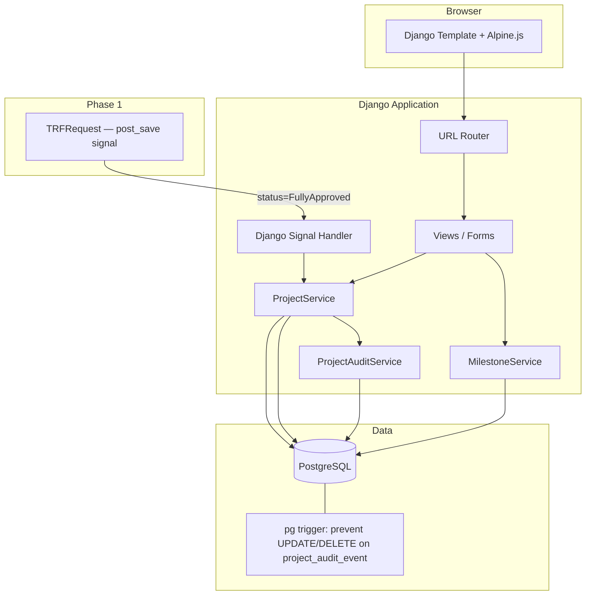
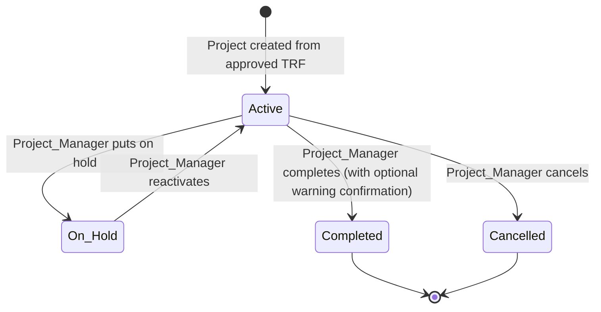

# Design Document: Projects and Milestones

## Overview

The Projects and Milestones feature is Phase 2 of the ATA Workflow Manager. It automatically creates a `Project` record when a TRF reaches `FullyApproved` status, then provides a full CRUD interface for `Milestone` management throughout the project lifecycle.

The system is built on the same Django + PostgreSQL stack as Phase 1. Business logic lives in a dedicated `ProjectService` layer. An immutable `ProjectAuditEvent` table — protected by a PostgreSQL trigger — provides the 7-year audit trail required by the requirements.

### Key Design Goals

- Zero-touch project creation: a Django signal fires on TRF approval and creates the Project + Milestones atomically
- Strict role-based access: Project_Manager roles (PC, PDR, CDR, Ops_Manager) can mutate; Sales_User is read-only
- Immutable audit trail enforced at the database level, not just the ORM level
- Variance detection: milestones snapshot the original Costing Sheet values so drift is always visible
- State machine with guard rails: delete blocked on In_Progress/Completed milestones; completion warning for incomplete milestones

---

## Architecture



The signal handler (`trf_fully_approved`) listens on `TRFRequest.post_save`. When `status` transitions to `FullyApproved` it calls `ProjectService.create_from_trf()` inside a `transaction.atomic()` block. Failures are caught, logged, and do **not** roll back the TRF status.

---

## Components and Interfaces

### URL Patterns

```python
# projects/urls.py
urlpatterns = [
    path("",                                    views.project_list,         name="project_list"),
    path("<int:pk>/",                           views.project_detail,       name="project_detail"),
    path("<int:pk>/status/",                    views.project_status,       name="project_status"),
    path("<int:pk>/milestones/create/",         views.milestone_create,     name="milestone_create"),
    path("<int:pk>/milestones/<int:ms_pk>/",    views.milestone_detail,     name="milestone_detail"),
    path("<int:pk>/milestones/<int:ms_pk>/edit/",   views.milestone_edit,   name="milestone_edit"),
    path("<int:pk>/milestones/<int:ms_pk>/delete/", views.milestone_delete, name="milestone_delete"),
]
```

### Views

| View | Method | Auth Guard | Description |
|---|---|---|---|
| `project_list` | GET | Login required | Lists all projects; filtered by role |
| `project_detail` | GET | Login required | Project + milestones + audit trail |
| `project_status` | POST | Project_Manager | Transition project status |
| `milestone_create` | GET/POST | Project_Manager | Add a new milestone |
| `milestone_detail` | GET | Login required | Single milestone read |
| `milestone_edit` | GET/POST | Project_Manager | Edit milestone fields |
| `milestone_delete` | POST | Project_Manager | Delete with guard checks |

### ProjectService

```python
class ProjectService:
    @staticmethod
    def create_from_trf(trf: TRFRequest) -> Project:
        """Called by signal. Atomic. Logs failure without raising."""

    @staticmethod
    def transition_status(project: Project, user: User, new_status: str, reason: str = "") -> Project:
        """Validates allowed transition, writes audit event."""
```

### MilestoneService

```python
class MilestoneService:
    @staticmethod
    def create(project: Project, user: User, data: dict) -> Milestone: ...

    @staticmethod
    def update(milestone: Milestone, user: User, data: dict) -> Milestone: ...

    @staticmethod
    def delete(milestone: Milestone, user: User) -> None:
        """Raises MilestoneDeletionError if status != Pending."""
```

### ProjectAuditService

```python
class ProjectAuditService:
    @staticmethod
    def record(project: Project, actor: User, action: str, detail: dict = None) -> ProjectAuditEvent:
        """INSERT only — never UPDATE or DELETE."""
```

### Permission Helpers

```python
PROJECT_MANAGER_ROLES = {"PC", "PDR", "CDR", "Ops_Manager"}

def is_project_manager(user: User) -> bool: ...
def is_sales_user(user: User) -> bool: ...
def require_project_manager(view_func): ...   # decorator
```

Role is stored on `UserProfile.role` (a CharField). The decorator returns 403 if the user's role is not in `PROJECT_MANAGER_ROLES`.

---

## Data Models

### Project

```python
class Project(models.Model):
    class Status(models.TextChoices):
        ACTIVE    = "Active"
        ON_HOLD   = "On_Hold"
        COMPLETED = "Completed"
        CANCELLED = "Cancelled"

    trf           = models.OneToOneField(
        "trf.TRFRequest", on_delete=models.PROTECT, related_name="project"
    )
    name          = models.CharField(max_length=255)          # copied from trf.project_name
    sales_user    = models.ForeignKey(
        User, on_delete=models.PROTECT, related_name="owned_projects"
    )
    status        = models.CharField(
        max_length=20, choices=Status.choices, default=Status.ACTIVE
    )
    trf_approved_at = models.DateTimeField()                  # snapshot of TRF approval timestamp
    created_at    = models.DateTimeField(auto_now_add=True)
    updated_at    = models.DateTimeField(auto_now=True)

    class Meta:
        ordering = ["-created_at"]
```

The `OneToOneField` on `trf` enforces the "exactly one Project per approved TRF" constraint at the database level (unique index).

### Milestone

```python
class Milestone(models.Model):
    class Status(models.TextChoices):
        PENDING     = "Pending"
        IN_PROGRESS = "In_Progress"
        COMPLETED   = "Completed"
        CANCELLED   = "Cancelled"

    project       = models.ForeignKey(Project, on_delete=models.CASCADE, related_name="milestones")

    # Editable fields
    name          = models.CharField(max_length=255)
    target_date   = models.DateField()
    description   = models.TextField(blank=True)
    status        = models.CharField(
        max_length=20, choices=Status.choices, default=Status.PENDING
    )

    # TRF Expense linkage
    is_trf_expense = models.BooleanField(default=False)
    cost_amount    = models.DecimalField(max_digits=12, decimal_places=2, null=True, blank=True)
    currency       = models.CharField(max_length=3, blank=True)   # ISO 4217

    # Read-only snapshot from Costing Sheet (set once on creation, never updated)
    costing_sheet_line_item_id = models.CharField(max_length=100, blank=True)
    original_cost_amount       = models.DecimalField(max_digits=12, decimal_places=2, null=True, blank=True)
    original_currency          = models.CharField(max_length=3, blank=True)

    # Tracking
    created_by    = models.ForeignKey(User, on_delete=models.PROTECT, related_name="created_milestones")
    created_at    = models.DateTimeField(auto_now_add=True)
    updated_by    = models.ForeignKey(
        User, on_delete=models.PROTECT, related_name="updated_milestones", null=True, blank=True
    )
    updated_at    = models.DateTimeField(auto_now=True)

    class Meta:
        ordering = ["target_date"]
```

The three `original_*` fields are written once during `ProjectService.create_from_trf()` and are never exposed in edit forms. `MilestoneService.update()` explicitly excludes them from the fields it writes.

**Variance detection**: a model property computes the indicator:

```python
@property
def has_cost_variance(self) -> bool:
    if not self.is_trf_expense or self.original_cost_amount is None:
        return False
    return self.cost_amount != self.original_cost_amount or self.currency != self.original_currency
```

### ProjectAuditEvent

```python
class ProjectAuditEvent(models.Model):
    class Action(models.TextChoices):
        PROJECT_CREATED      = "PROJECT_CREATED"
        STATUS_CHANGED       = "STATUS_CHANGED"
        MILESTONE_CREATED    = "MILESTONE_CREATED"
        MILESTONE_UPDATED    = "MILESTONE_UPDATED"
        MILESTONE_DELETED    = "MILESTONE_DELETED"

    project    = models.ForeignKey(Project, on_delete=models.PROTECT, related_name="audit_events")
    actor      = models.ForeignKey(User, on_delete=models.PROTECT)
    action     = models.CharField(max_length=50, choices=Action.choices)
    detail     = models.JSONField(default=dict)   # changed fields, old/new values, reason, etc.
    timestamp  = models.DateTimeField(auto_now_add=True)

    class Meta:
        ordering = ["timestamp"]
        # No update/delete permissions at ORM level — enforced by pg trigger below
```

#### PostgreSQL Trigger (immutability)

A migration applies this trigger to the `projects_projectauditevent` table:

```sql
CREATE OR REPLACE FUNCTION prevent_audit_event_mutation()
RETURNS TRIGGER AS $$
BEGIN
    RAISE EXCEPTION 'Audit events are immutable and cannot be modified or deleted.';
END;
$$ LANGUAGE plpgsql;

CREATE TRIGGER trg_audit_event_immutable
BEFORE UPDATE OR DELETE ON projects_projectauditevent
FOR EACH ROW EXECUTE FUNCTION prevent_audit_event_mutation();
```

This is applied via a `RunSQL` operation in a dedicated migration so it survives `migrate` on fresh deployments.

---

## Project Status State Machine



### Transition Table

| From | To | Guard |
|---|---|---|
| Active | On_Hold | None |
| Active | Completed | If incomplete milestones exist → warn + require confirmation |
| Active | Cancelled | None |
| On_Hold | Active | None |
| Completed | * | Blocked — terminal state |
| Cancelled | * | Blocked — terminal state |

Invalid transitions raise `ProjectTransitionError`. The completion warning is implemented as a two-step POST: the first POST returns a confirmation page listing incomplete milestones; the second POST (with `confirmed=true`) executes the transition.

---

## Milestone Delete Guard

`MilestoneService.delete()` enforces:

```python
def delete(milestone: Milestone, user: User) -> None:
    if milestone.status == Milestone.Status.IN_PROGRESS:
        raise MilestoneDeletionError(
            "This milestone is In Progress. Change its status to Pending before deleting."
        )
    if milestone.status == Milestone.Status.COMPLETED:
        raise MilestoneDeletionError(
            "Completed milestones cannot be deleted."
        )
    # Pending and Cancelled are deletable
    ProjectAuditService.record(
        milestone.project, user, ProjectAuditEvent.Action.MILESTONE_DELETED,
        {"milestone_name": milestone.name, "milestone_id": milestone.pk}
    )
    milestone.delete()
```

The view renders the error message inline without a redirect.

---

## TRF Expense Linkage

When `ProjectService.create_from_trf()` iterates the TRF's `Expense` queryset, it maps fields as follows:

| TRF `Expense` field | Milestone field |
|---|---|
| `line_item_id` | `costing_sheet_line_item_id` (read-only snapshot) |
| `amount` | `original_cost_amount` (read-only snapshot) + initial `cost_amount` |
| `currency` | `original_currency` (read-only snapshot) + initial `currency` |

`is_trf_expense` is set to `True` when `amount` is non-null; `False` otherwise.

The Project detail page shows a **TRF Expense Summary** table and computes:

```
total_trf_approved  = sum of original_cost_amount for all TRF_Expense milestones
total_current       = sum of cost_amount for all TRF_Expense milestones
variance            = total_current - total_trf_approved
```

---

## Error Handling

| Scenario | Behaviour |
|---|---|
| Project creation fails after TRF approval | Exception caught, logged with TRF id + timestamp, TRF status unchanged |
| Duplicate project creation for same TRF | `IntegrityError` on `OneToOneField` caught and logged; no second project created |
| Invalid project status transition | `ProjectTransitionError` → 400 with user-facing message |
| Milestone missing name or target date | Form validation error; milestone not saved |
| TRF_Expense milestone missing cost/currency | Form validation error; milestone not saved |
| Delete of In_Progress milestone | `MilestoneDeletionError` → inline error message |
| Delete of Completed milestone | `MilestoneDeletionError` → inline error message |
| Sales_User attempts create/edit/delete | 403 Forbidden |
| Completion with incomplete milestones | Warning page listing milestones; requires `confirmed=true` POST |
| Audit event UPDATE/DELETE attempted | PostgreSQL trigger raises exception → 500 with log |

