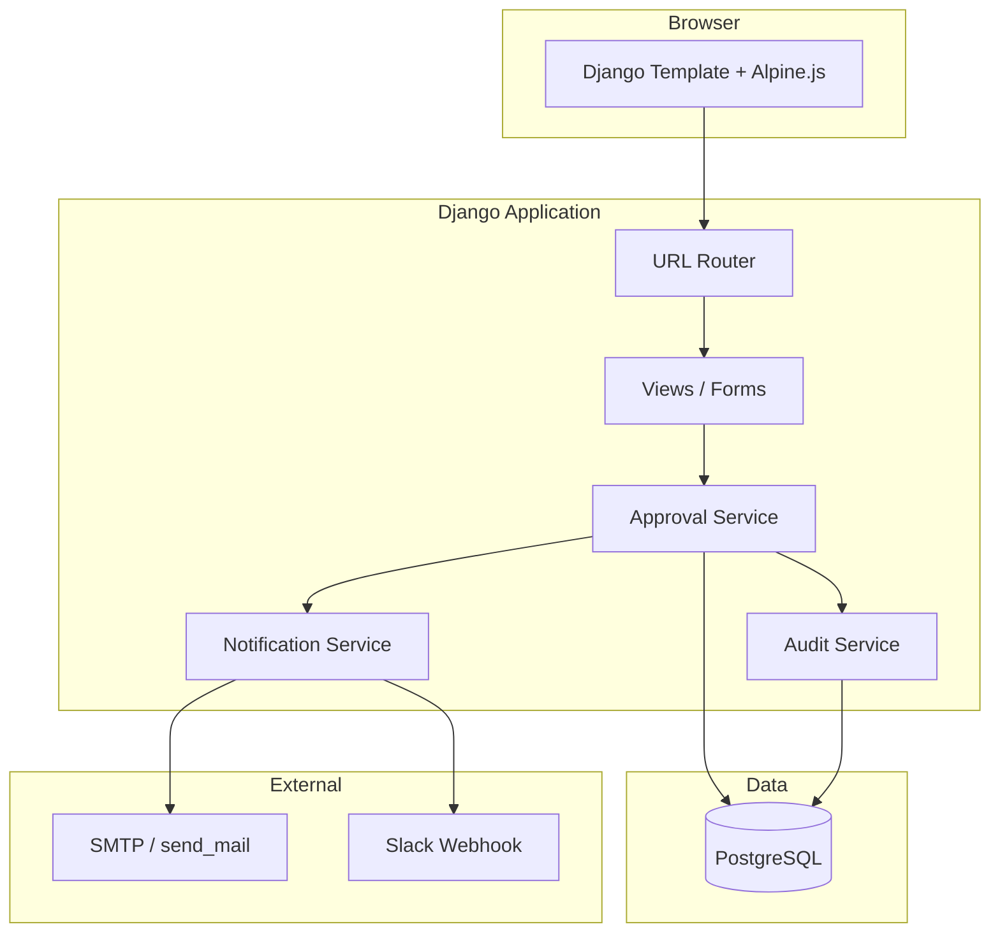
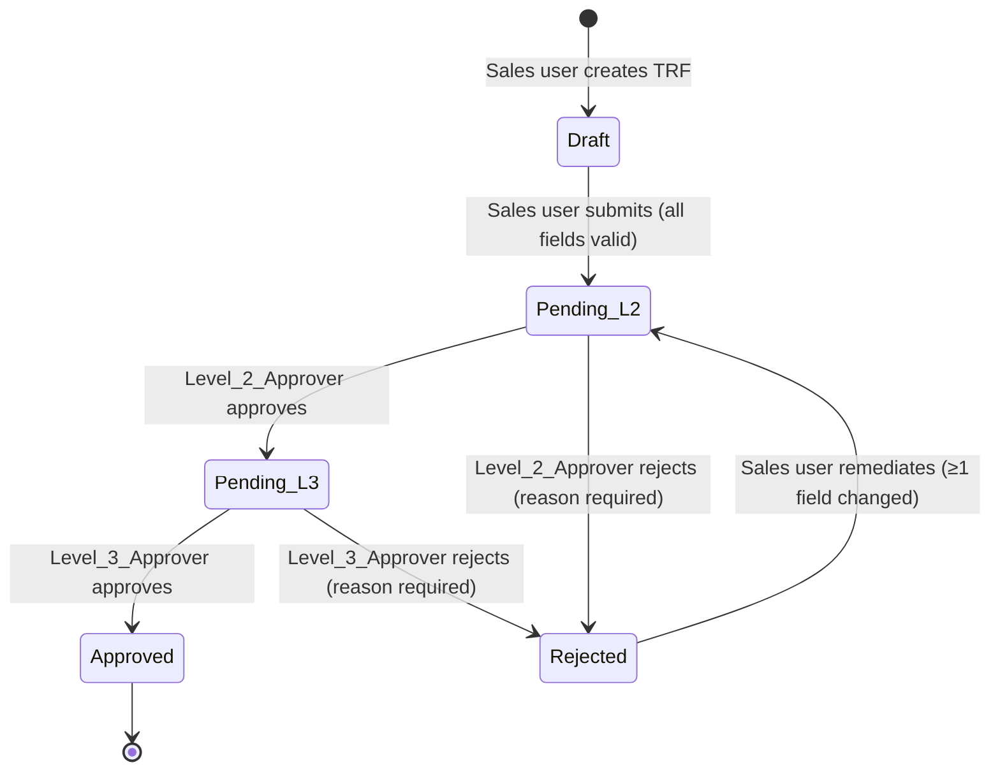

# Design Document: TRF Approval System

## Overview

The TRF Approval System is a Django-based internal workflow tool for ATA International. It manages the lifecycle of Training Request Forms (TRFs) from creation through a two-level approval chain, with post-approval notifications to Finance and Operations teams.

The system is built on Django + PostgreSQL, rendered via Django Templates with Alpine.js for lightweight interactivity, and hosted on Railway or Render. Authentication uses Django's built-in `auth` framework. There is no separate frontend SPA.

### Key Design Goals

- Enforce a strict sequential approval state machine (Draft → Submitted → Pending_L2 → Pending_L3 → Approved / Rejected)
- Restrict approval actions to named approvers at the correct level
- Provide a full, immutable audit trail for every TRF
- Deliver post-approval notifications via email (Django `send_mail`) and optional Slack webhook, with failure isolation

---

## Architecture



The application follows a standard Django MVT pattern. Business logic for state transitions lives in a dedicated `ApprovalService` class rather than in views, keeping views thin. Notifications are dispatched synchronously after a successful state transition; Slack failures are caught and logged without rolling back the transition.

---

## Components and Interfaces

### URL Patterns

```python
# trf/urls.py
urlpatterns = [
    path("",                              views.trf_list,        name="trf_list"),
    path("create/",                       views.trf_create,      name="trf_create"),
    path("<int:pk>/",                     views.trf_detail,      name="trf_detail"),
    path("<int:pk>/submit/",              views.trf_submit,      name="trf_submit"),
    path("<int:pk>/approve/",             views.trf_approve,     name="trf_approve"),
    path("<int:pk>/reject/",              views.trf_reject,      name="trf_reject"),
    path("<int:pk>/remediate/",           views.trf_remediate,   name="trf_remediate"),
    path("approver/availability/",        views.set_availability, name="set_availability"),
]
```

### Views

| View | Method | Auth Guard | Description |
|---|---|---|---|
| `trf_list` | GET | Login required | Shows queue filtered by user role |
| `trf_create` | GET/POST | Sales user | Create and save Draft TRF |
| `trf_detail` | GET | Login required | TRF detail + audit trail |
| `trf_submit` | POST | TRF owner | Transition Draft → Pending_L2 |
| `trf_approve` | POST | Level approver | Advance state (L2→L3 or L3→Approved) |
| `trf_reject` | POST | Level approver | Transition to Rejected with reason |
| `trf_remediate` | GET/POST | TRF owner | Edit rejected TRF and resubmit |
| `set_availability` | GET/POST | Named approver | Toggle availability + set delegate |

### ApprovalService

```python
class ApprovalService:
    def submit(trf, user) -> TRFRequest
    def approve(trf, user) -> TRFRequest
    def reject(trf, user, reason: str) -> TRFRequest
    def remediate(trf, user, cleaned_data: dict) -> TRFRequest
```

Each method validates the current state, checks user permissions, writes an `AuditEvent`, and calls `NotificationService` as appropriate.

### NotificationService

```python
class NotificationService:
    def notify_l2_approvers(trf) -> None
    def notify_l3_approvers(trf) -> None
    def notify_submitter_rejected(trf) -> None
    def notify_post_approval(trf) -> None   # email Finance + email + Slack Ops
```

Slack failures are caught with a bare `except Exception`, logged to `NotificationLog`, and do not re-raise.

---

## Data Models

### TRFRequest

```python
class TRFRequest(models.Model):
    class Status(models.TextChoices):
        DRAFT        = "DRAFT"
        PENDING_L2   = "PENDING_L2"
        PENDING_L3   = "PENDING_L3"
        APPROVED     = "APPROVED"
        REJECTED     = "REJECTED"
        REMEDIATION  = "REMEDIATION"   # alias for in-progress remediation edit

    # Core fields
    project_name      = models.CharField(max_length=255)
    training_start    = models.DateField()
    status            = models.CharField(max_length=20, choices=Status.choices, default=Status.DRAFT)

    # Ownership
    submitted_by      = models.ForeignKey(User, on_delete=models.PROTECT, related_name="trf_submissions")
    submitted_at      = models.DateTimeField(null=True, blank=True)

    # Remediation tracking
    remediated_at     = models.DateTimeField(null=True, blank=True)
    previous_snapshot = models.JSONField(null=True, blank=True)  # stores field values before remediation

    created_at        = models.DateTimeField(auto_now_add=True)
    updated_at        = models.DateTimeField(auto_now=True)
```

### Milestone

```python
class Milestone(models.Model):
    trf         = models.ForeignKey(TRFRequest, on_delete=models.CASCADE, related_name="milestones")
    name        = models.CharField(max_length=255)
    target_date = models.DateField()
```

### Expense

```python
class Expense(models.Model):
    trf         = models.ForeignKey(TRFRequest, on_delete=models.CASCADE, related_name="expenses")
    description = models.CharField(max_length=255)
    amount      = models.DecimalField(max_digits=12, decimal_places=2)
    currency    = models.CharField(max_length=3)  # ISO 4217
```

### TRFApproval

Tracks each approval or rejection event at a specific level.

```python
class TRFApproval(models.Model):
    class Level(models.IntegerChoices):
        L2 = 2
        L3 = 3

    class Action(models.TextChoices):
        APPROVED = "APPROVED"
        REJECTED = "REJECTED"

    trf          = models.ForeignKey(TRFRequest, on_delete=models.PROTECT, related_name="approvals")
    level        = models.IntegerField(choices=Level.choices)
    action       = models.CharField(max_length=10, choices=Action.choices)
    actor        = models.ForeignKey(User, on_delete=models.PROTECT)
    reason       = models.TextField(blank=True)   # required when action=REJECTED
    acted_at     = models.DateTimeField(auto_now_add=True)
```

### NotificationLog

```python
class NotificationLog(models.Model):
    class Channel(models.TextChoices):
        EMAIL = "EMAIL"
        SLACK = "SLACK"
        IN_APP = "IN_APP"

    class Result(models.TextChoices):
        SUCCESS = "SUCCESS"
        FAILURE = "FAILURE"

    trf        = models.ForeignKey(TRFRequest, on_delete=models.PROTECT, related_name="notification_logs")
    channel    = models.CharField(max_length=10, choices=Channel.choices)
    recipient  = models.CharField(max_length=255)   # email address, Slack channel, or username
    result     = models.CharField(max_length=10, choices=Result.choices)
    error_msg  = models.TextField(blank=True)
    sent_at    = models.DateTimeField(auto_now_add=True)
```

### AuditEvent

Immutable record of every state transition and actor action.

```python
class AuditEvent(models.Model):
    trf        = models.ForeignKey(TRFRequest, on_delete=models.PROTECT, related_name="audit_events")
    actor      = models.ForeignKey(User, on_delete=models.PROTECT)
    action     = models.CharField(max_length=50)   # e.g. "SUBMITTED", "APPROVED_L2", "REJECTED_L3"
    from_status = models.CharField(max_length=20)
    to_status   = models.CharField(max_length=20)
    reason     = models.TextField(blank=True)
    timestamp  = models.DateTimeField(auto_now_add=True)

    class Meta:
        ordering = ["timestamp"]
```

No `update` or `delete` permissions are granted on `AuditEvent` at the ORM or database level. A PostgreSQL trigger enforces this at the database level:

```sql
CREATE OR REPLACE FUNCTION prevent_audit_event_mutation()
RETURNS TRIGGER AS $$
BEGIN
    RAISE EXCEPTION 'Audit events are immutable and cannot be modified or deleted.';
END;
$$ LANGUAGE plpgsql;

CREATE TRIGGER trg_audit_event_immutable
BEFORE UPDATE OR DELETE ON trf_auditevent
FOR EACH ROW EXECUTE FUNCTION prevent_audit_event_mutation();
```

#### Migration Safety Note

The audit trigger does NOT block `ALTER TABLE` operations. Migrations that add/remove columns on the audit table will work normally. Only row-level `UPDATE` or `DELETE` statements are blocked.

### ApproverProfile

Extends the built-in `User` to track level, availability, and delegation.

```python
class ApproverProfile(models.Model):
    class Level(models.IntegerChoices):
        L2 = 2
        L3 = 3

    user        = models.OneToOneField(User, on_delete=models.CASCADE, related_name="approver_profile")
    level       = models.IntegerField(choices=Level.choices)
    is_available = models.BooleanField(default=True)
    delegate    = models.ForeignKey(
        "self", null=True, blank=True, on_delete=models.SET_NULL, related_name="delegating_to"
    )
```

Named approvers are seeded via a Django management command or data migration. The six named approvers are:

- Level 2: Aidan, Trevor, Tasneem
- Level 3: Sharona, Melisa, Andre

---

## Approval State Machine



### Transition Rules

| From | To | Actor | Guard |
|---|---|---|---|
| Draft | Pending_L2 | TRF owner | All required fields present |
| Pending_L2 | Pending_L3 | Level 2 approver | User has `ApproverProfile.level == 2` and `is_available` (or is active delegate) |
| Pending_L2 | Rejected | Level 2 approver | Same as above + reason non-empty |
| Pending_L3 | Approved | Level 3 approver | User has `ApproverProfile.level == 3`; user is NOT the same person who approved at L2 on this TRF |
| Pending_L3 | Rejected | Level 3 approver | Same as above + reason non-empty |
| Rejected | Pending_L2 | TRF owner | At least one field differs from `previous_snapshot` |

Invalid transitions raise a `TransitionError` (custom exception), which views catch and render as a 400 response with a user-facing message.

---

## Error Handling

| Scenario | Behaviour |
|---|---|
| Required field missing on submit | Form validation error; TRF stays Draft |
| Unauthorised user attempts approve/reject | 403 Forbidden |
| Invalid state transition attempted | `TransitionError` → 400 with message |
| Rejection submitted without reason | Form validation error; state unchanged |
| Remediation submitted with no changes | Validation error; state unchanged |
| Slack webhook failure | Caught, logged to `NotificationLog`, approval proceeds |
| Finance email failure | Caught, logged to `NotificationLog`, approval proceeds |
| All L2 approvers unavailable | Warning notification sent to L3 approvers; TRF stays Pending_L2 |
| All L3 approvers unavailable | Warning notification sent to system admin; TRF stays Pending_L3 |

---

## Testing Strategy

### Dual Approach

Both unit tests and property-based tests are required. They are complementary:

- Unit tests cover specific examples, integration points, and error conditions
- Property-based tests verify universal correctness across randomised inputs

### Unit Tests

Focus areas:
- State machine transitions: one test per valid transition, one per invalid transition
- Permission guards: non-approver cannot approve; L2 approver cannot act as L3 on same TRF
- Notification isolation: Slack failure does not roll back approval
- Remediation: unchanged form is rejected; changed form restarts workflow
- Audit trail: every transition writes an `AuditEvent`; no event can be deleted

### Property-Based Tests

Use `hypothesis` (Python PBT library). Each test runs a minimum of 100 iterations.

Tag format: `# Feature: trf-approval-system, Property {N}: {property_text}`

### Property: Audit events are immutable

For any `AuditEvent` record, after it is created, any `UPDATE` or `DELETE` operation on that specific row MUST fail with a database-level error. `SELECT` and `ALTER TABLE` operations must continue to work normally. No application-level code change is required — this property is enforced entirely by the PostgreSQL trigger on the `trf_auditevent` table.

